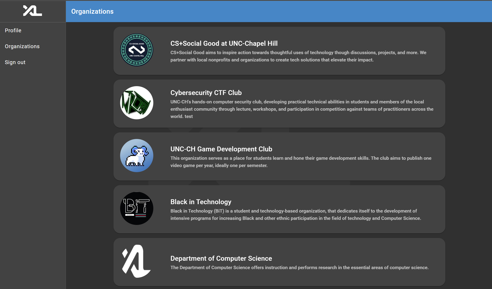
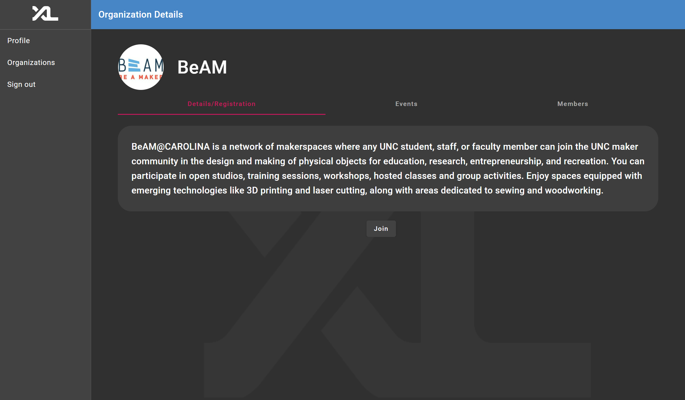
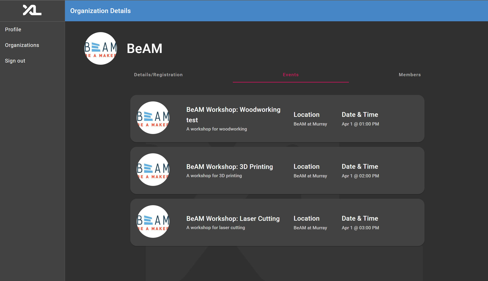
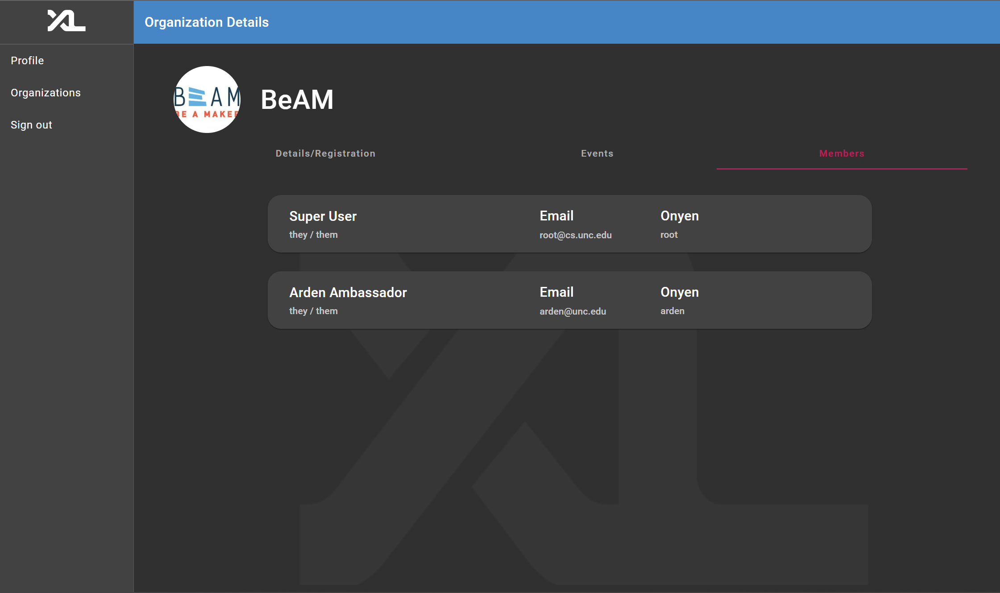
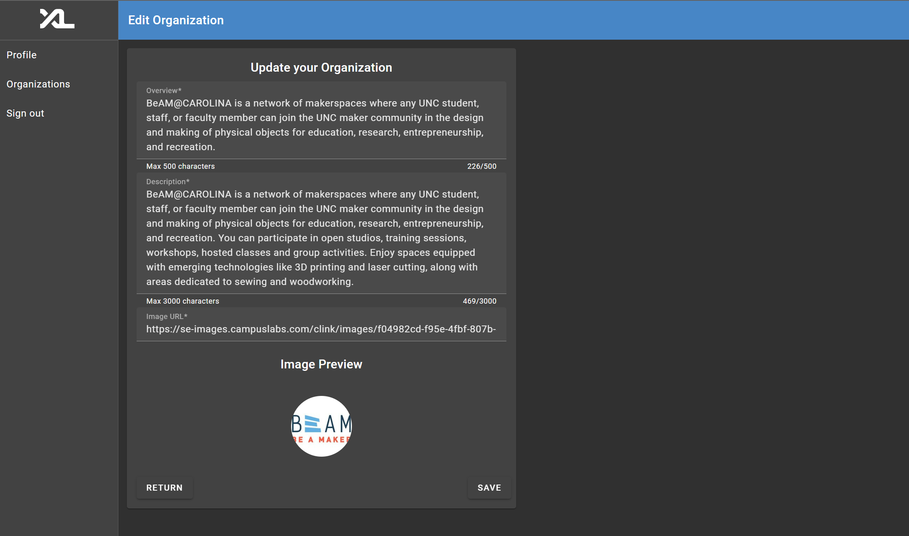
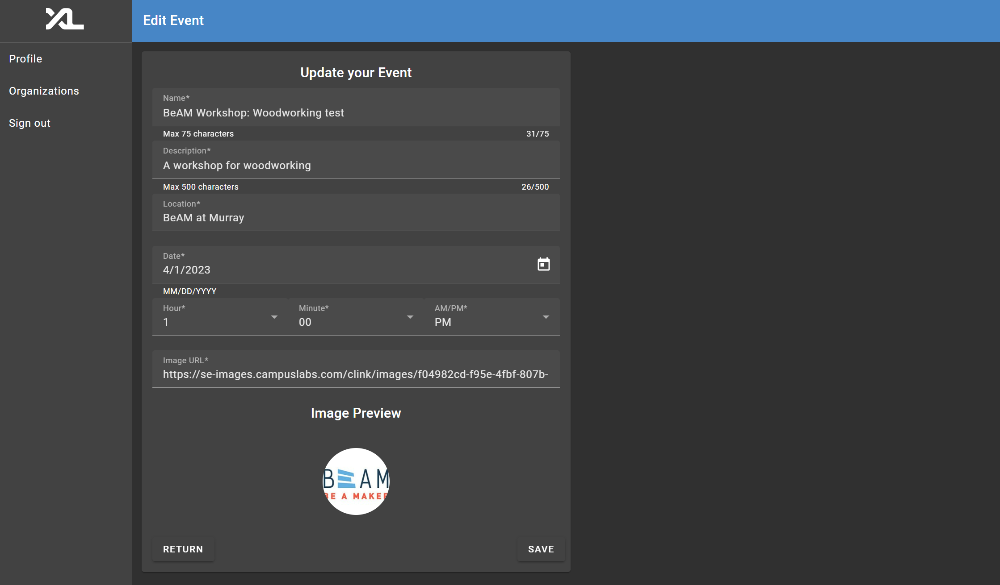
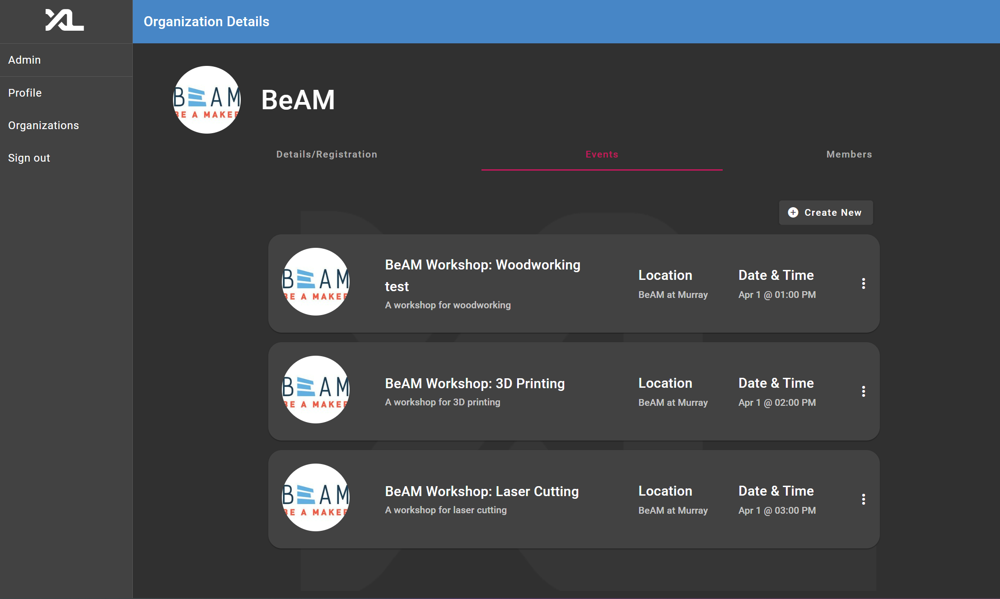
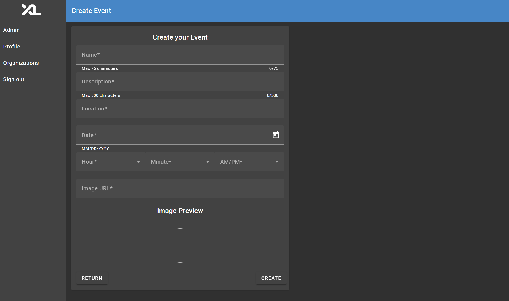
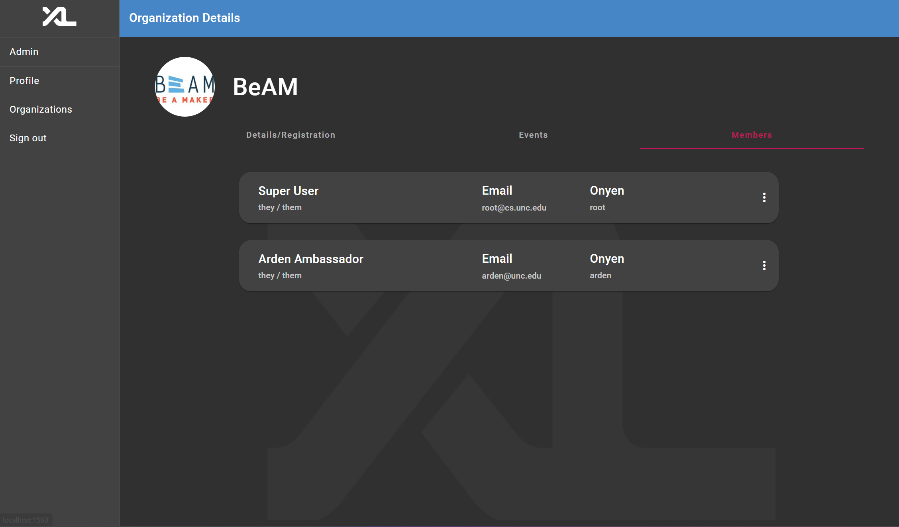
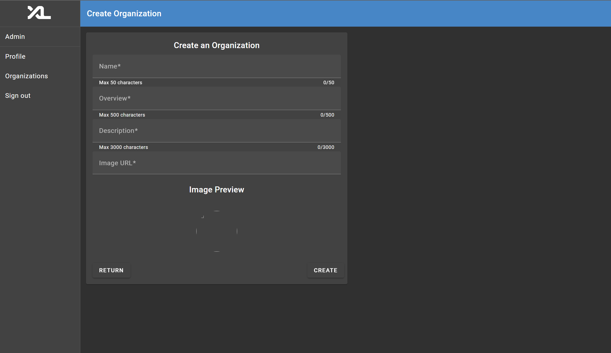

# **Feature Documentation - Organizations**

  
Table of Contents

  <ol>
    <li>
      <a href="#authors">Authors</a>
    </li>
    <li>
      <a href="#overview">Overview</a>
    </li>
    <li>
      <a href="#permissions--views">Permissions & Views</a>
      <ul>
        <li><a href="#student">Student</a></li>
        <li><a href="#ambassador">Ambassador</a></li>
        <li><a href="#manager">Manager</a></li>
        <li><a href="#admin">Admin</a></li>
      </ul>
    </li>
    <li>
      <a href="#entities">Entities</a>
      <ul>
        <li><a href="#organization">Organization</a></li>
        <li><a href="#event">Event</a></li>
      </ul>
    </li>
    <li>
      <a href="#design">Design</a>
      <ul>
        <li><a href="#frontend">Frontend</a></li>
        <li><a href="#backend">Backend</a></li>
      </ul>
    </li>
    <li>
      <a href="#development-concerns--notes">Development Concerns & Notes</a>
      <ul>
        <li><a href="#frontend-1">Frontend</a></li>
        <li><a href="#backend-1">Backend</a></li>
      </ul>
    </li>
    <li>
      <a href="#future-work">Future Work</a>
      <ul>
        <li><a href="#frontend-2">Frontend</a></li>
        <li><a href="#backend-2">Backend</a></li>
      </ul>
    </li>
  </ol>

  

## **Authors**
- [Jackson Davis](https://github.com/Jackson-Davis1)
- [Yueun Kang](https://github.com/yueunkang)
- [Antonio Tudela](https://github.com/antud)
- [Binhang Li](https://github.com/libinhang)

  

## **Overview**
The Organizations page serves as the hub for students looking to explore new clubs. It consists of the '/organizations' page, and the '/organizations/:organizationName' pages. The former lists organizations along with a brief overview, and the latter shows much more detailed information, namely registration, events, and member details.

The primary goal of the organizations feature is to serve a *student* of the University of North Carolina at Chapel Hill.

  

# **Permissions & Views**
# Student
## **Student** - Permissions
The student role has the most basic permissions on the CSXL site, consisting of only viewing the three main entities: Organizations, Events, and Members. \
Their permissions are outlined below.
<table class="tg">
<thead>
  <tr>
    <th class="tg-0lax"></th>
    <th class="tg-0lax">View</th>
    <th class="tg-0lax">Edit</th>
    <th class="tg-0lax">Delete</th>
    <th class="tg-0lax">Create</th>
  </tr>
</thead>
<tbody>
  <tr>
    <td class="tg-0lax">Organizations</td>
    <td class="tg-0lax"></td>
    <td class="tg-0lax"></img></td>
    <td class="tg-0lax"></img></td>
    <td class="tg-0lax"></img></td>
  </tr>
  <tr>
    <td class="tg-0lax">Events</td>
    <td class="tg-0lax"></td>
    <td class="tg-0lax"></img></td>
    <td class="tg-0lax"></img></td>
    <td class="tg-0lax"></img></td>
  </tr>
  <tr>
    <td class="tg-0lax">Members</td>
    <td class="tg-0lax"></td>
    <td class="tg-0lax">-</img></td>
    <td class="tg-0lax"></img></td>
    <td class="tg-0lax">-</img></td>
  </tr>
</tbody>
</table>

One important note is that students(along with every other role) should be able to join and leave organizations at any time.
## **Student** - Views

### Organizations

Note that the student has only the ability to view and click on prospective organizations.

### Organization Details

Note that the student has the ability to click join to become a member of the organization.

### Organization Events

### Organization Members

  
# Ambassador
## **Ambassador** - Permissions
The ambassador role is meant to act as an editor for an organization, with extra permissions beyond a student to edit organization details and organization events. \
Their permissions are outlined below.
<table class="tg">
<thead>
  <tr>
    <th class="tg-0lax"></th>
    <th class="tg-0lax">View</th>
    <th class="tg-0lax">Edit</th>
    <th class="tg-0lax">Delete</th>
    <th class="tg-0lax">Create</th>
  </tr>
</thead>
<tbody>
  <tr>
    <td class="tg-0lax">Organizations</td>
    <td class="tg-0lax"></td>
    <td class="tg-0lax"></img></td>
    <td class="tg-0lax"></img></td>
    <td class="tg-0lax"></img></td>
  </tr>
  <tr>
    <td class="tg-0lax">Events</td>
    <td class="tg-0lax"></td>
    <td class="tg-0lax"></img></td>
    <td class="tg-0lax"></img></td>
    <td class="tg-0lax"></img></td>
  </tr>
  <tr>
    <td class="tg-0lax">Members</td>
    <td class="tg-0lax"></td>
    <td class="tg-0lax">-</img></td>
    <td class="tg-0lax"></img></td>
    <td class="tg-0lax">-</img></td>
  </tr>
</tbody>
</table>

## **Ambassador** - Views
### Organizations

Note that as opposed to the student view, the ambassador can see three dots which when clicked, allow for editing of an organization details. (For demo purposes it is present on all organizations, but in implementation it would be present for clubs the user has edit permissions)

### Organization Edit

Note that roles with edit permission can only edit the details, not the organization name. Images are rendered from urls (as opposed to storing in a database).Clicking 'save' should save any updates, and clicking 'return' should return the user to the organizations page.

### Organization Details
[Identical to Student](#student---views)

### Organization Events

Note that just like the organzations page, the ambassador has the option to click the three dots to edit an event.

### Event Edit

Note that the Date field is entered using Angular's calendar material, and the Minutes field is limited to 00, 15, 30, and 45 for simplicity.

### Organization Members
[Identical to Student](#student---views)

  

# Manager
## **Manager** - Permissions
The manager role is meant to act as both an editor, manager, and planner for an organization, with extra permissions beyond a ambassador to create events and remove members. \
Their permissions are outlined below.
<table class="tg">
<thead>
  <tr>
    <th class="tg-0lax"></th>
    <th class="tg-0lax">View</th>
    <th class="tg-0lax">Edit</th>
    <th class="tg-0lax">Delete</th>
    <th class="tg-0lax">Create</th>
  </tr>
</thead>
<tbody>
  <tr>
    <td class="tg-0lax">Organizations</td>
    <td class="tg-0lax"></td>
    <td class="tg-0lax"></img></td>
    <td class="tg-0lax"></img></td>
    <td class="tg-0lax"></img></td>
  </tr>
  <tr>
    <td class="tg-0lax">Events</td>
    <td class="tg-0lax"></td>
    <td class="tg-0lax"></img></td>
    <td class="tg-0lax"></img></td>
    <td class="tg-0lax"></img></td>
  </tr>
  <tr>
    <td class="tg-0lax">Members</td>
    <td class="tg-0lax"></td>
    <td class="tg-0lax">-</img></td>
    <td class="tg-0lax"></img></td>
    <td class="tg-0lax">-</img></td>
  </tr>
</tbody>
</table>

## **Manager** - Views

### Organizations
[Identical to Ambassador](#ambassador---views)
(with an extra delete option on clicking three dots for their organization)

### Organization Edit
[Identical to Ambassador](#ambassador---views)

### Organization Details
[Identical to Student](#student---views)

### Organization Events

Note that the Manager, as opposed to the Ambassador, has the 'Create New' button, which will bring them to the create event page. They also have an extra delete option when clicking the three dots.

### Event Create

Note that this page functions almost identically to the 
Event edit ([See ambassador views](#ambassador---views)) with the only difference in the 'Create' button instead of the 'Save'.

### Event Edit
[Identical to Ambassador](#ambassador---views)

### Organization Members

Note that as opposed to the Ambassador, the Manager has three dots, which when clicks allows for removal of members of the organization.

  

# Admin
## **Admin** - Permissions
The admin role is meant to have the ability to perform all actions on the CSXL site. \
Their permissions are outlined below.
<table class="tg">
<thead>
  <tr>
    <th class="tg-0lax"></th>
    <th class="tg-0lax">View</th>
    <th class="tg-0lax">Edit</th>
    <th class="tg-0lax">Delete</th>
    <th class="tg-0lax">Create</th>
  </tr>
</thead>
<tbody>
  <tr>
    <td class="tg-0lax">Organizations</td>
    <td class="tg-0lax"></td>
    <td class="tg-0lax"></img></td>
    <td class="tg-0lax"></img></td>
    <td class="tg-0lax"></img></td>
  </tr>
  <tr>
    <td class="tg-0lax">Events</td>
    <td class="tg-0lax"></td>
    <td class="tg-0lax"></img></td>
    <td class="tg-0lax"></img></td>
    <td class="tg-0lax"></img></td>
  </tr>
  <tr>
    <td class="tg-0lax">Members</td>
    <td class="tg-0lax"></td>
    <td class="tg-0lax">-</img></td>
    <td class="tg-0lax"></img></td>
    <td class="tg-0lax">-</img></td>
  </tr>
</tbody>
</table>

Note that the admin should have these permissions for *all* organizations.

## **Admin** - Views

### Organizations
[Identical to Ambassador](#ambassador---views) 
(with an extra delete option on clicking three dots for any organization)

### Organization Create

Note that the functionality here is exactly like the organization details edit ([See Ambassador Views](#ambassador---views)), with a 'Create' instead of a 'Save'. 
### Organization Edit
[Identical to Ambassador](#ambassador---views)

### Organization Details
[Identical to Student](#student---views)

### Organization Events
[Identical to Manager](#manager---views)

### Event Create
[Identical to Manager](#manager---views)

### Event Edit
[Identical to Ambassador](#ambassador---views)

### Organization Members
[Identical to Manager](#manager---views) 

  

# **Entities**
The two main entities that were necessary to be created for the organizations feature specifically were the Organization entity and the Event entity. 
## **Organization**
| **Field**   | **Type** | **Notes**                                                                         |
|-------------|----------|-----------------------------------------------------------------------------------|
| id          | int      | The primary key (unique)                                                          |
| name        | string   | The name of the organization (unique)                                                      |
| overview    | string   | The short overview of the organization shown on the organizations page            |
| description | string   | The longer description of the organization shown on the organization details page |
| image       | string   | The image of the organization (as a url)                                          |
## **Event**

|    **Field**         | **Type** | **Notes**                                                         |
|-----------------|----------|-------------------------------------------------------------------|
| id              | int      | The primary key (unique)                                          |
| name            | string   | The name of the event                                             |
| description     | string   | The description of the event                                      |
| date_time       | DateTime | The date & time of the event (in Postgres' Unix time)             |
| location        | string   | The location of the event                                         |
| image           | string   | The image of the event (as a url)                                 |
| organization_id | int      | The associated id with the organization the event is for (unique) |

  

# **Design**
## **Frontend**
A unique feature of this implementation is that the permissions are simply baked into the features, rather than separated by a tab. The 'Admin' tab is not actually used for organization admin permissions, and it is instead baked into the same views that the students have. 

This way it is a much more seemless experience for both students and admins alike. Another benefit is that this method allows much less repetitive code. For example, Only one component is needed to render organizations, instead of two (one for admin and one for students).

One other noteworthy design choice is that the feature is entirely built out of angular materials, which is adhered to throughought the CSXL site as a whole.

## **Backend**

Organization names are unique, as to avoid duplicate names and confusing searches for students.

The ordering of organization events is in the order of soonest occuring first in order to make it easier for students to view upcoming events and be able to adjust and plan accordingly. 

The ordering of organizations is by created date, mainly for feedback for admins who create events.

  

# **Development Concerns & Notes**

## **Frontend**

Frontend development of this feature adheres to using only angular materials. Each individual view for organizations is within its own folder, and nested views within organizations have their own nested components. (i.e. the organization members folder is nested within the organization-details folder).

Generally, components are merely for rendering data, and both logic, and calls to the api are delegated to services elsewhere. 

## **Backend**

Backend development is structured strictly into api endpoints, services, and testing. Every method has its own unique unit test, nested within a folder with the same name as the service.

Another important note is that dev data is nested into a folder with the same name, and the script to reset the database with that dev data is nested within a folder with the name 'scripts'.

note: **The reset database script must be run for any dev data updates to be reflected.** This includes the **deployed site.** 

  

# **Future Work**
There are many more improvements to the organizations feature that could be implemented, the most important of which are outlined below by stack and in decreasing order of importance. 
## **Frontend**
### **Pagination**
As the scale of the site grows, pagination will ulimately be needed for organizations, events, and memebers. This could consist of a multipage selection at the bottom of the screen, with a 'next' and 'previous' button that shows the next 25 of whatever list the user is using.
### **Search Function**
One convenient addition to the frontend could be a search function, for organizations, members, and events. This could consist of a small search bar above the associated list, and when a user types it dynamically filters the list below.

## **Backend**
### **User Roles per Organization**
One major functionality that is left out of the current implementation is mapping users to roles per organization. As shown in the views, a manager can effectively 'manage' all organizations. In reality, they should only be able to manage one organization, or organizations that they are a manager of. This is also equally true for ambassadors. This can be manually implemented by creating a manager/ambassdor role for every organization, however a much better solution would be to have users have different roles per organization. This would require some overhaul of the backend, but would enable a much more robust feature. This would allow, for example, promotions/demotions of members to different roles within an organization to be implementable.